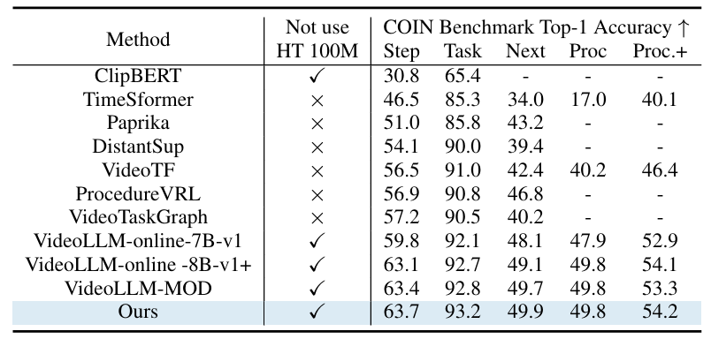

<!-- <p align="center">
    
<p> -->

<h3 align="center"><a href="https://arxiv.org/html/2503.06220" style="color:#9C276A">
StreamMind: Unlocking Full Frame Rate Streaming Video Dialogue through Event-Gated Cognition</a></h3>
<h5 align="center"> If our project helps you, please give us a star ⭐ on GitHub to support us. 🙏🙏 </h2>

<h5 align="center">

[](https://arxiv.org/html/2503.06220v1) <br>

<!-- </h5> -->
<!-- 
<details open><summary>💡 Some other multimodal-LLM projects from our team may interest you ✨. </summary><p>
 may

<!-- > [**Video-LLaMA: An Instruction-tuned Audio-Visual Language Model for Video Understanding**](https://github.com/DAMO-NLP-SG/Video-LLaMA) <br>
> Hang Zhang, Xin Li, Lidong Bing <br>
[](https://github.com/DAMO-NLP-SG/Video-LLaMA)  [](https://github.com/DAMO-NLP-SG/Video-LLaMA) [](https://arxiv.org/abs/2306.02858) <br>

> [**VCD: Mitigating Object Hallucinations in Large Vision-Language Models through Visual Contrastive Decoding**](https://arxiv.org/abs/2311.16922) <br>
> Sicong Leng, Hang Zhang, Guanzheng Chen, Xin Li, Shijian Lu, Chunyan Miao, Lidong Bing <br>
[](https://github.com/DAMO-NLP-SG/VCD)  [](https://github.com/DAMO-NLP-SG/VCD)  [](https://arxiv.org/abs/2311.16922) <br> -->

<!-- </p></details> -->

<!-- <div align="center"><video src="https://github.com/DAMO-NLP-SG/VideoLLaMA2/assets/18526640/e0e7951c-f392-42ed-afad-b2c7984d3e38" width="800"></div>
 -->

## 📰 News
* **[2025.03.18]**  Release training, evaluation, and serving codes of StreamMind.
<div align="center">
    
</div>

## 🛠️ Requirements and Installation
Basic Dependencies:
* Python >= 3.10
* Pytorch >= 2.5.1
* CUDA Version >= 11.8
* transformers >= 4.44.2 (for mistral tokenizer)
* tokenizers >= 0.19.1 (for mistral tokenizer)

**[Online Mode]** Install required packages (better for development):
```bash
git clone https://github.com/xinding-sys/StreamMind
cd StreamMind
pip install -r requirements.txt
pip install flash-attn==2.5.8 --no-build-isolation
```

## 🚀 Main Results

### Streaming Dialogue
<div align="center">
    
</div>
<div align="center">
    
</div>

### Offline benchmark
<div align="center">
    
</div>
<div align="center">
    
</div>


## 🗝️ Training & Evaluation

### Quick Start

<!-- 1. Training Data Structure:
```bash
VideoLLaMA2
├── datasets
│   ├── videollava_pt
|   |   ├── llava_image/ # Available at: https://pan.baidu.com/s/17GYcE69FcJjjUM0e4Gad2w?pwd=9ga3 or https://drive.google.com/drive/folders/1QmFj2FcMAoWNCUyiUtdcW0-IOhLbOBcf?usp=drive_link
|   |   ├── valley/      # Available at: https://pan.baidu.com/s/1jluOimE7mmihEBfnpwwCew?pwd=jyjz or https://drive.google.com/drive/folders/1QmFj2FcMAoWNCUyiUtdcW0-IOhLbOBcf?usp=drive_link
|   |   └── valley_llavaimage.json # Available at: https://drive.google.com/file/d/1zGRyVSUMoczGq6cjQFmT0prH67bu2wXD/view, including 703K video-text and 558K image-text pairs
│   ├── videollava_sft
|   |   ├── llava_image_tune/  # Available at: https://pan.baidu.com/s/1l-jT6t_DlN5DTklwArsqGw?pwd=o6ko
|   |   ├── videochatgpt_tune/ # Available at: https://pan.baidu.com/s/10hJ_U7wVmYTUo75YHc_n8g?pwd=g1hf
|   |   └── videochatgpt_llavaimage_tune.json # Available at: https://drive.google.com/file/d/1zGRyVSUMoczGq6cjQFmT0prH67bu2wXD/view, including 100K video-centric, 625K image-centric and 40K text-only conversations
``` -->
1. Command:
```bash
# Streammind train stage 1
bash scripts/custom/finetune_stage1.sh
# Streammind train stage 2
bash scripts/custom/finetune_stage2.sh
# Streammind evaluate
bash scripts/custom/eval/evaluate.sh
```
3. Evaluation Data Structure:
```bash
VideoLLaMA2
├── eval
│   ├── egoschema # Official website: https://github.com/egoschema/EgoSchema
|   |   ├── good_clips_git/ # Available at: https://drive.google.com/drive/folders/1SS0VVz8rML1e5gWq7D7VtP1oxE2UtmhQ
|   |   └── questions.json  # Available at: https://github.com/egoschema/EgoSchema/blob/main/questions.json
│   ├── mvbench # Official website: https://huggingface.co/datasets/OpenGVLab/MVBench
|   |   ├── video/
|   |   |   ├── clever/
|   |   |   └── ...
|   |   └── json/
|   |   |   ├── action_antonym.json
|   |   |   └── ...
│   ├── perception_test_mcqa # Official website: https://huggingface.co/datasets/OpenGVLab/MVBench
|   |   ├── videos/ # Available at: https://storage.googleapis.com/dm-perception-test/zip_data/test_videos.zip
|   |   └── mc_question_test.json # Download from https://storage.googleapis.com/dm-perception-test/zip_data/mc_question_test_annotations.zip
│   ├── videomme # Official website: https://video-mme.github.io/home_page.html#leaderboard
|   |   ├── test-00000-of-00001.parquet
|   |   ├── videos/
|   |   └── subtitles/
│   ├── Activitynet_Zero_Shot_QA # Official website: https://github.com/MILVLG/activitynet-qa
|   |   ├── all_test/   # Available at: https://mbzuaiac-my.sharepoint.com/:u:/g/personal/hanoona_bangalath_mbzuai_ac_ae/EatOpE7j68tLm2XAd0u6b8ABGGdVAwLMN6rqlDGM_DwhVA?e=90WIuW
|   |   ├── test_q.json # Available at: https://github.com/MILVLG/activitynet-qa/tree/master/dataset
|   |   └── test_a.json # Available at: https://github.com/MILVLG/activitynet-qa/tree/master/dataset
│   ├── MSVD_Zero_Shot_QA # Official website: https://github.com/xudejing/video-question-answering
|   |   ├── videos/     
|   |   ├── test_q.json 
|   |   └── test_a.json
│   ├── videochatgpt_gen # Official website: https://github.com/mbzuai-oryx/Video-ChatGPT/tree/main/quantitative_evaluation
|   |   ├── Test_Videos/ # Available at: https://mbzuaiac-my.sharepoint.com/:u:/g/personal/hanoona_bangalath_mbzuai_ac_ae/EatOpE7j68tLm2XAd0u6b8ABGGdVAwLMN6rqlDGM_DwhVA?e=90WIuW
|   |   ├── Test_Human_Annotated_Captions/ # Available at: https://mbzuaiac-my.sharepoint.com/personal/hanoona_bangalath_mbzuai_ac_ae/_layouts/15/onedrive.aspx?id=%2Fpersonal%2Fhanoona%5Fbangalath%5Fmbzuai%5Fac%5Fae%2FDocuments%2FVideo%2DChatGPT%2FData%5FCode%5FModel%5FRelease%2FQuantitative%5FEvaluation%2Fbenchamarking%2FTest%5FHuman%5FAnnotated%5FCaptions%2Ezip&parent=%2Fpersonal%2Fhanoona%5Fbangalath%5Fmbzuai%5Fac%5Fae%2FDocuments%2FVideo%2DChatGPT%2FData%5FCode%5FModel%5FRelease%2FQuantitative%5FEvaluation%2Fbenchamarking&ga=1
|   |   ├── generic_qa.json     # These three json files available at: https://mbzuaiac-my.sharepoint.com/personal/hanoona_bangalath_mbzuai_ac_ae/_layouts/15/onedrive.aspx?id=%2Fpersonal%2Fhanoona%5Fbangalath%5Fmbzuai%5Fac%5Fae%2FDocuments%2FVideo%2DChatGPT%2FData%5FCode%5FModel%5FRelease%2FQuantitative%5FEvaluation%2Fbenchamarking%2FBenchmarking%5FQA&ga=1
|   |   ├── temporal_qa.json
|   |   └── consistency_qa.json
```


## 📑 Citation

If you find StreamMind useful for your research and applications, please cite using this BibTeX:
```bibtex
@article{ding2025streammind,
  title={StreamMind: Unlocking Full Frame Rate Streaming Video Dialogue through Event-Gated Cognition},
  author={Ding, Xin and Wu, Hao and Yang, Yifan and Jiang, Shiqi and Bai, Donglin and Chen, Zhibo and Cao, Ting},
  journal={arXiv preprint arXiv:2503.06220},
  year={2025}
}
```

## 👍 Acknowledgement
The codebase of StreamMind is adapted from [**VideoLLaMA 2**](https://github.com/DAMO-NLP-SG/VideoLLaMA2), We are also grateful for the following projects our StreamMind arise from:
* [**LLaMA 2**](https://github.com/meta-llama/llama), [**Mistral-7B**](https://mistral.ai/news/announcing-mistral-7b/), [**OpenAI CLIP**](https://openai.com/index/clip/), [**Honeybee**](https://github.com/kakaobrain/honeybee).
* [**Video-ChatGPT**](https://github.com/mbzuai-oryx/Video-ChatGPT), [**Video-LLaVA**](https://github.com/PKU-YuanGroup/Video-LLaVA). 
* [**WebVid**](https://github.com/m-bain/webvid), [**Panda-70M**](https://github.com/snap-research/Panda-70M), [**LanguageBind**](https://github.com/PKU-YuanGroup/LanguageBind), [**InternVid**](https://github.com/OpenGVLab/InternVideo/tree/main/Data/InternVid).
* [**VideoChat2**](https://github.com/OpenGVLab/Ask-Anything/tree/main/video_chat2), [**Valley**](https://github.com/RupertLuo/Valley), [**VTimeLLM**](https://github.com/huangb23/VTimeLLM), [**ShareGPT4V**](https://sharegpt4v.github.io/).


## 🔒 License

This project is released under the Apache 2.0 license as found in the LICENSE file.
The service is a research preview intended for **non-commercial use ONLY**, subject to the model Licenses of LLaMA and Mistral, Terms of Use of the data generated by OpenAI, and Privacy Practices of ShareGPT. Please get in touch with us if you find any potential violations.
